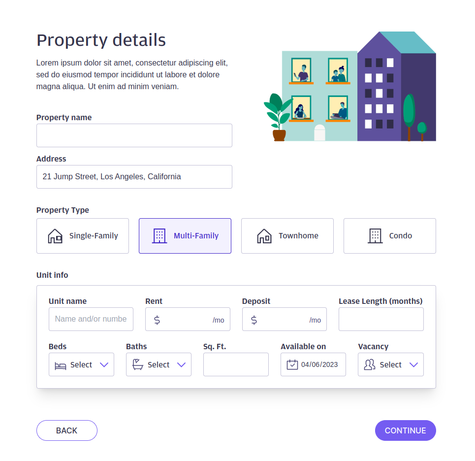

# Exercise

Please follow the README-DevEnv.md setup guide for the server until the smoke tests and unit tests are completed:
[README-DevEnv.md](https://github.com/gitricko/nameko-devex/blob/master/README-DevEnv.md)

After that, get into the gateapi/web folder, i.e.,

```
cd gateapi/web
```

Then do npm install:

```
npm install
```

Once npm install was completed, you can start the app by doing:

```
npm run dev
```

After the app started, you can view the app by opening the browser and accessing this url: http://localhost:3000

Here are the 2 tasks that you should attempt to complete in the exercise:

1. For the **Property details** page, please implement and style the page according to this [Figma mocks](https://bit.ly/3pcGsLl). For the CSS part, please only utilize tailwind css to complete this page [Tailwind CSS docs](https://tailwindcss.com/docs/installation)
2. For **Page Two** page, please call the orders API as outlined in the [API Smoke Tests](https://github.com/gitricko/nameko-devex/blob/master/test/nex-smoketest.sh) and retrieve order with id 1 and display response from the API on the page.

## Problems

### Broken Dependencies

Initially, the project didn't work when attempting to install and run it, as there were several issues preventing the server from starting at localhost:3000. These issues were related to the `package-lock.json` file being missing and the package @sveltejs/kit being set to next in the `package.json` file. This was easily solved by restoring the previous `package-lock.json` file and installing the correct dependencies to the project to run with the current configuration.

### Missing Proper CORS Configuration on Backend

Another issue encountered was the CORS problem when attempting to consume data from the API in http://localhost:8000 from the client application on http://localhost:3000. This was due to missing configuration on the nameko server allowing the server to be called from another domain. After some research on what could solve this issue, I decided to use Allow CORS Chrome Extension to bypass it. However, this extension should not be used for production or staging environments, as it puts the application at a serious vulnerability.

As this was a frontend test, I did not want to spend too much time debugging Python code.

## Development


The first task was developed as instructed, using only TailwindCSS. I did a custom theme configuration using variables from the Figma Design.

The only place using custom CSS is the components/datePicker.svelte file, as I was customizing a native pseudo component, calendar-picker-indicator, and couldn't do it with Tailwind.

When it comes to components, I created a couple of reusable components. I used the icons as Svelte components as well, which allowed me to use them as components and pass the color as a prop. I also saved the icons as SVGs to optimize the bundle size.

The second task was a little bit more tricky, as I had to consume the API and display the data. I decided to use the axios library to do this, as it is a simple and easy-to-use library to consume APIs. The hard part about the second task was creating a UI for an order information. I decided not to show all the information provided by the API, as it would be a lot of information to display. When checking an order, the user probably does not want to get information about stock, passenger capacity, max speed, etc. Therefore, I decided to show only the most important information, such as the order number, product name, product price, product quantity, and the total price of that product and order.

## Futher Improvements

If I had more time, I would improve the UI for the second task, as I did not have much time to think about the best way to display the information. I would also add a way to show additional information about the product, such as a "See More" button or a redirect to the product page.

The project is currently running but still uses a lot of old dependencies. I would update all the dependencies to the latest version and fix any breaking changes, and update to the latest version of Svelte Kit.

Tests are missing, and I would add some tests to the project using Vitest and Cypress. Especially for the second task, since it is a bit more complex, this would be a good way to test the API integration.

With a little bit more knowledge about the backend, I would love to solve the CORS problem and remove the Chrome extension. This would make it easier to run the project and test it on local environments.
